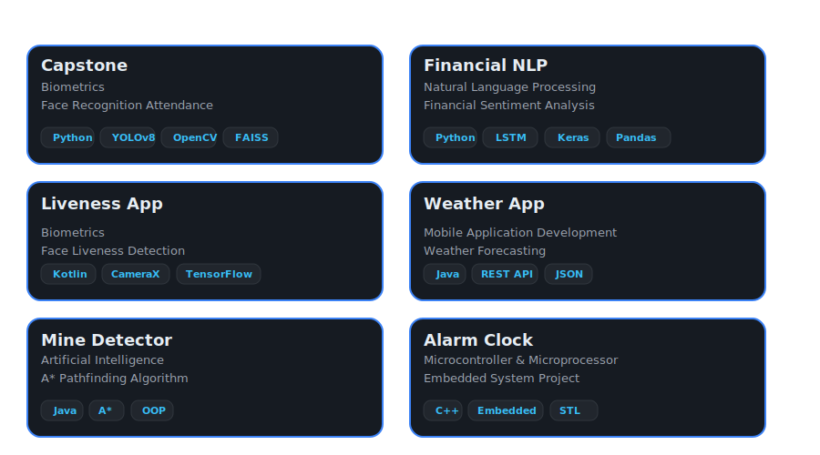

<picture>
  <source media="(prefers-color-scheme: dark)" srcset="banner.svg">
  <source media="(prefers-color-scheme: light)" srcset="banner-light.svg">
  
</picture>

  

<table align="center" border="0" width="100%">
<tr>
<td width="70%" valign="top">

# 👋 Hey there! I'm Nachiket Palekar

<!-- A sleek typing animation for your header -->

 
I love turning complex data into simple, meaningful experiences. As an MBA Tech student with a passion for Business Intelligence, I build interactive dashboards, custom data visualizations, and data-driven applications that help people make smarter decisions. From crafting advanced Power BI visuals  to developing scalable solutions in IBM Cognos Analytics, I enjoy combining creativity with analytics.

 
Beyond BI, I have experience in full-stack development using React, Node.js, and Firebase, allowing me to transform ideas into complete digital products. I'm constantly exploring new technologies, improving my problem-solving skills, and building solutions that create real business impact—one project at a time.

</td>
<td width="30%" align="center" valign="top">
  
</td>
</tr>
</table>

 

<table align="center" border="0" width="100%">
<tr>
<td width="50%" valign="top">

### 🚀 What I'm Up To
- **Working On:** Building interactive **IBM Cognos Analytics** & **Power BI** dashboards with advanced KPIs and custom visuals.
- **Developing:** Full-stack web applications using **React**, **Node.js**, and **Firebase**.
- **Exploring:** AI-powered analytics, custom BI visualizations, and data storytelling.
- **Learning:** Business Intelligence, Data Engineering concepts, and modern UI/UX for analytics dashboards.
- **Ask Me About:** Business Analytics, Power BI, IBM Cognos, React, Node.js, or Full-Stack Development.

</td>
<td width="50%" valign="top">

### 📂 Featured Projects

</td>
</tr>
</table>

 

### 📈 GitHub Stats & Activity

<!-- Custom Animated Cards (Themed Local SVGs) -->

  

<!--  -->

<!--    -->

<!-- Real-time GitHub Streak (Custom Blue/Sky-Blue Theme) -->

  

<!-- Real-time Contribution Graph (Custom Blue/Sky-Blue Theme) -->

  

### 📫 Let's Connect

  

> *"Programs must be written for people to read, and only incidentally for machines to execute."*  
> — *Harold Abelson*

